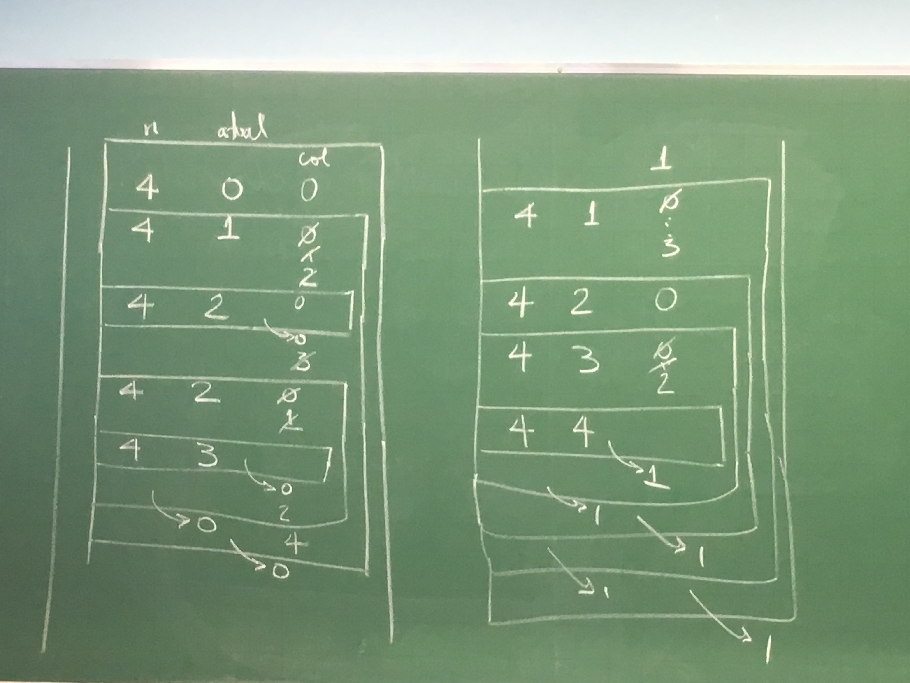

# Recursão

Terça, 11 de setembro

- Torres de Hanoi
- Fractais

Retomando o problema das n Rainhas:

Dado n>0, é posível colocar n rainhas num tabileiro de xadrez sem que elas se ataquem?

- n=4

```
+-----+-+
| |R| | |
+-------+
| | | |R|
+-------+
|R| | | |
+-------+
| | |R| |
+-+-----+
```

- n=3

```
+-+-+-+
| | | |
+-----+
| | | |
+-----+
| | | |
+-+-+-+
```

```C
int nRainhasrec(int **tab, int n, int atual) {
    /* devolve 1 se é possível, 0 caso contrário */
    if (atual == n) return 1;
    for (col = 0; col < n; col++)
        if (PosicaoLivre(tab, n, atual, col) == 1) {
            tab[atual][col] = 1;
            if (nRainhasrec(tab, n, atual+1))
                return 1;
            tab[atual][col] = 0;
        }
    return 0;
}

int main() {
    int **tab, n;
    scanf("%d", &n);
    tab = alocaMatriz(n, n);
    if (nRainhasrec(tab, n, 0) == 1)
        imprimeMatriz(tab, n, n);
    else
        printf("Não tem solução\n");
}
```

Simulação

- n=3

```
   n    atual   col         =] representa o retorno da função
+----------------------+
|  3      0      0     |
+--------------------+ |
|  3      1      0   | |
|                1   | |
|                2   | |
+------------------+ | |
|  3      2   0,1,2| | |
|                3 | | |
+------------------+ | |
|       =]0      3   | |
+--------------------+ |
|       =]0      1     |
+--------------------+ |
|  3      1      0   | |
+--------------------+ |
|       =]0      2     |
+--------------------+ |
|  3      1      0   | |
+------------------+ | |
|  3      2      0 | | |
+------------------+ | |
|         =]0  1,2,3 | |
+--------------------+ |
|                3     |
+----------------------+
                =]0
```

- n=4




Faça uma função recursiva que recebe um vetor `v`, com `n >= 0` inteiros e um inteiro `x` e devolve um índice `i` do vetor com `v[i] = x` ou `-1` se `x` não está no vetor.

```C
int buscarec(int v[], int n, int x) {
    if (n == 0)
        return -1;
    
    if (v[n-1] == x)
        return n - 1;

    return busca(v, n-1, x);
    // Pior caso:   O(n)  x não está
    // Melhor caso: O(1)  x == v[n-1]
}

int busca(int v[], int n, int x) { // versão iterativa
    int i = n - 1;
    while (i >= 0 && v[i] != x)
        i--;
    return i;
    // Pior caso:   O(n)  x não está
    // Melhor caso: O(1)  x == v[n-1]
}
```


E na média? (qual a complexidade assintótica no "caso médio"?)

Supondo que x está no vetor e pode estar em qualquer posição com igual probabilidade.

$$
\begin{aligned}
\mathbb{E}(\text{nº de iterações}) &= 1 * \dfrac{1}{n} + 2 * \dfrac{1}{n} + \ldots + n * \dfrac{1}{n} \\
 &= \dfrac{1}{n}(1+2+\ldots+n) \\
 &= \dfrac{1}{n}\left(\dfrac{(n+1)n}{2}\right) \\
 &= \dfrac{n+1}{2}
 
\end{aligned}
$$


## Busca binária

```C
int buscabinR(int v[], int inicio, int fim, int x) {
    int meio;
    if (fim < inicio)
        return -1;
    meio = (inicio + fim)/2;
    if (v[meio] == x)
        return inicio;
    if (v[meio] == x) return meio;
    if (v[meio] > x) return buscabinR(v, inicio, meio-1, x);
    return buscabinR(v, meio+1, fim, x);
}
```

```C
int buscabin(int v[], int n, int x) {
    int inicio, fim, meio;
    inicio = 0; fim = n-1;
    while (inicio <= fim) {
        meio = (inicio + fim)/2;
        if (v[meio] == x) return meio;
        if (v[meio] > x) fim = meio - 1;
        else inicio = meio + 1;
    }
    return -1;
}
```

Supondo que está no vetor e `v[i] ==x` com igual probabilidade para `i=0 ... n-1`:

$$
\begin{aligned}
\mathbb{E}(\text{nº de iterações}) &= 1 * \dfrac{1}{n} + 2 * \dfrac{1}{n} + 3 * \dfrac{1}{n} + \ldots + log_2{n} * \dfrac{1}{n} \\
 &= \dfrac{1}{n}(1+2+3+\ldots+log_2{n}) \\
 &= \dfrac{log_2{n}(log_2{n}+1)}{2n}
\end{aligned}
$$
