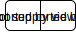

==============
Listas Ligadas
==============
Uma lista ligada armazena elementos de forma que vizinhos possam estar localizados em posições não adjacentes na memória:

Em uma lista ligada:

.. image:: resources/listaligada.svg

A ordem dos elementos na lista é dada através de apontadores. O primeiro elemento da lista é apontado pelo **início**. Cada célula da lista tem o seguinte aspecto:

.. code-block:: c

    struct celula {
        TipoDaLista info;
        struct celula *prox;
    }
    typedef struct celula *apontador;

Implementação
=============
Faça uma função que recebe uma lista ligada com números inteiros apontada por início e imprime os números.

Anexo: `listaligada.c`_

.. _listaligada.c: ../_static/listaligada.c
