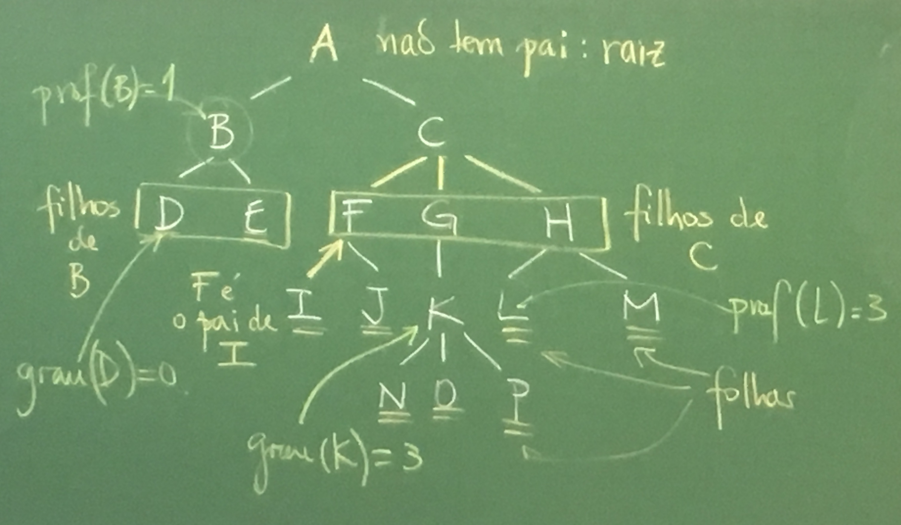
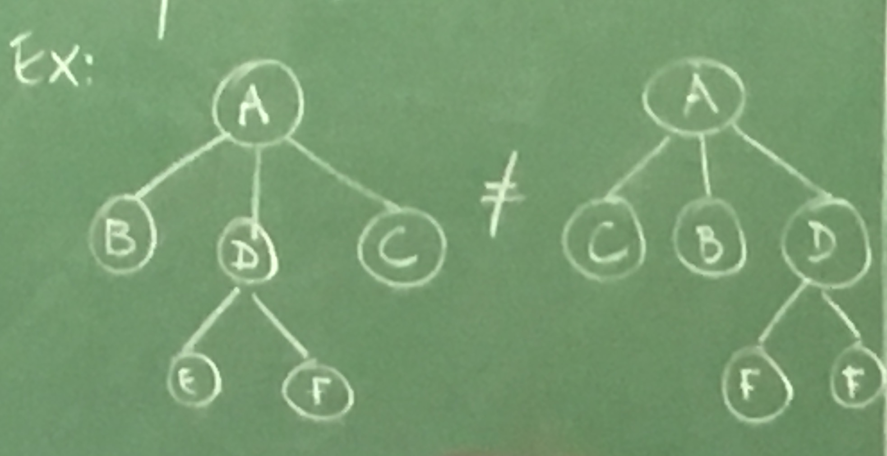
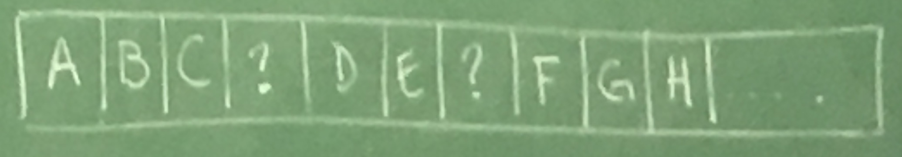
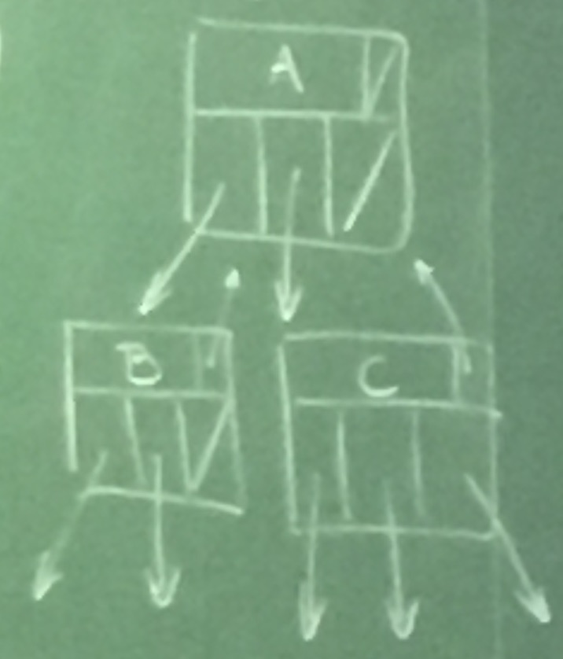
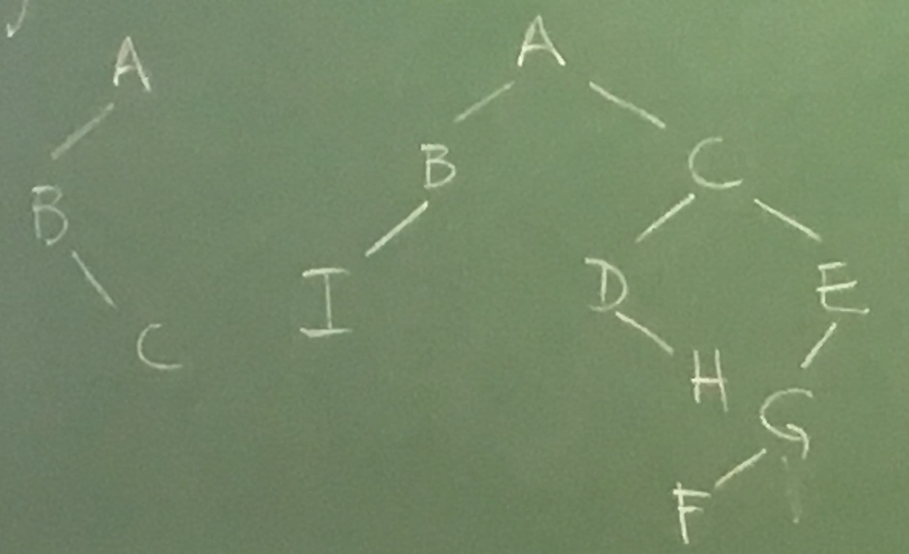
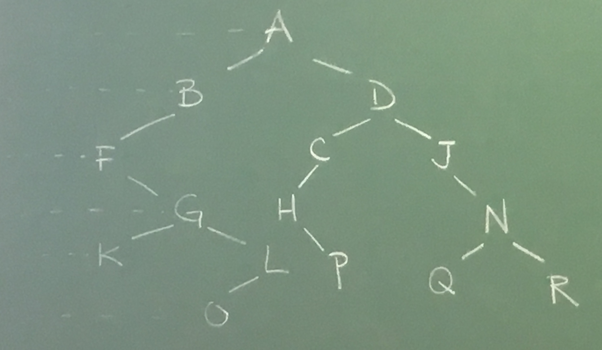

=======
Árvores
=======

Árvores são estruturas hierárquicas em que cada elemento (nó) está ligado a um número finito de sub-árvores disjuntas.

Os elementos diretamente ligados a um nó são seus filhos. Todo nó, com exceção à raiz da árvore, tem um único pai.

::

    B   D  Não é árvore
     \ /
      A

Os nós sem filhos são chamados de folhas da árvore. Todos os nós na árvore enraizada em um elemento são chamadas de descendentes. Ex: os descendentes de G são: G, K, N, O, P.

Os ancestrais de um nó são os nós no caminho até a raiz. Ex: acestrais de D são: D, B e A.

O grau de um nó é o número de filhos. Dizemos que uma árvore é k-ária se todos os nós tem grau <= k.
A profundidade de um nó é o número de ancestrais próprios que ele tem.

A altura de uma árvore é dada pela profundidade máxima de uma de suas folhas. No exemplo, a altura da árvore é 4.

A árvore vazia tem altura -1.

A árvore A tem altura zero.

Uma árvore é ordenada se faz diferença a ordem do filho:

Exemplo:

Representação: Como representar uma árvore k-ária?

Ideia: Vetor?

Problema: gasto de espaço

1o. Ideia: usando ponteiro:

.. code-block:: C

    typedef struct no {
        TipoDaArvore info;
        struct no *pai;
        struc no *filho[k];

    } No;

Problema: gasto de espaço.

2a. ideia

.. code-block:: C

    typedef struct cel {
      TipoDaArvore info;
      struct cel *pai;
      struct cel *filho;
      struct cel *irmao;
    } celula;

    typedef celula *apontador;

    int prof(apontador x) {
      /* x != NULL */
      int p = 0;
      while (x->pai != NULL) {
        p++;
        x = x->pai;
      }
      return p;
    }

    int graumax(apontador t) {
      // complexidade: O(n)

      int graut, g, maxg;
      apontador p;
      graut = maxg = 0;
      p = t->filho;

      while (p != NULL) {
        graut++;
        g = graumax(p);
        if (g > maxg) maxg = g;
        p = p->irmao;
      }

      if (graut > maxg)
        maxg = graut;

      return maxg;
    }

Árvores binárias
================
Árvores binárias são árvores ordenadas de grau máximo 2.

Quantas árvores binárias existem com n vértices?

========  =======
Vértices  Árvores
========  =======
1         0
2         2
3         5
4         14
5         ?
========  =======

O número é dado por:

.. math::

    C_n &= \dfrac{1}{n+1}\binom{2n}{n} \\

========  =======
Vértices  Árvores
========  =======
5         42
6         132
7         429
8         1430
9         4862
10        16796
========  =======

Número de Catalan (séc XIX)

Uma árvore binária é completa se tem todas as folhas possíveis na sua profundidade máxima.

.. image:: resources/arvore-completa.jpg

Uma árvore completa de altura h tem :math:`2^{h+1}-1` nós e :math:`2^h` filhos.

.. image:: resources/arvore-.jpg

Uma árvore binária com n vértices tem altura:

.. math::

    \lfloor \log_2{n} \rfloor \leq h \leq n - 1

Faça uma função que retorna a quantidade de vértices da árvore.

.. code-block:: C

    typedef struct no {
      TipoDaArvore info;
      struct no *pai;
      struct no *esq;
      struct no *dir;
    } No;

    typedef No *apontador;

    int contaNos(apontador t) {
      if (t->NULL) return 0;

      return contaNos(t->esq) + contaNos(t->dir) + 1;
    }

Faça uma função que calcula a altura da árvore.

.. code-block:: C

    int altura(apontador t) {
        int d, e;
        if (t == NULL) return -1;

        e = altura(t->esq);
        d = altura(t->dir);

        if (d > e)
            return d + 1;
        else
            return e + 1;
    }

Percursos
=========

---------------------
Busca em profundidade
---------------------
::

    A B F G K L O D C H P J N Q R

----------------
Busca em largura
----------------
::

    A B D F C J G H N K L P Q R O

---------
Pré-ordem
---------
::

    A B F G K L O D C H P J N Q R (idêntico a busca em profundidade)

- r - Visita a raiz;
- E - visito a subárvore esquerda da raiz em pré-ordem;
- D - visito a subárvore direita da raiz em pré-ordem;

.. code-block: C

    void preordem(apontador raiz) {
        if (raiz != NULL) {
            printf("%c", raiz->info);
            preordem(raiz->esq);
            preordem(raiz->dir);
        }
    }

--------
In-ordem
--------
::

    F K G O L B A H P C D J Q N R

- E - visita os nós da subárvore esquerda em in-ordem
- r - visita a raiz
- D - visita os nós da subárvore direita em in-ordem

.. code-block: C

    void inordem(apontador raiz) {
        if (raiz != NULL) {
            inordem(raiz->esq);
            printf("%c", raiz->info);
            inordem(raiz->dir);
        }
    }

----------
Pós-ordem
----------
::

    K O L G F B P H C Q R N J D A

- E - visita os nós da subárvore esquerda em in-ordem
- D - visita os nós da subárvore direita em in-ordem
- r - visita a raiz

----------
Aplicações
----------

Notação Aritmética
------------------
Os nomes pré-ordem, in-ordem e pós-ordem são devidos a aplicação direta em converter as notações aritmética infixa, prefixa e pós-fixa.

É possível remontar a árvore usando a pré-ordem e in-ordem.

É possível remontar usando a pós-ordem a in-ordem.

Não é possível remontar usando pré-ordem e pós-ordem.

Exercícios
----------

.. code-block:: C

    // menos eficiente (pode percorrer todos os vertices)
    int ancestral(apostador p, apontador q) {
        if (p == NULL || q == NULL)
            return 0;

        if (p == q)
            return 1;

        return ancestral(p->esq, q) || ancestral(p->direita, q);

        // feio
        // return p != NULL && q != NULL && p != q &&
        //     (ancestral(p->esq, q) || ancestral(p->direita, q));
    }

    // bem eficiente (percorre a distancia de vertices)
    int ancestral(apostador p, apontador q) {
        apontador aux = q;
        if (p == NULL)
            return 0;

        while (aux != NULL && aux != p)
            aux = aux->pai;

        return aux == p;
    }

    int nivel(apontador p) {
        /* p != NULL */
        int cont = 0;
        while (p->pai != NULL) {
            cont++;
            p = p->pai;
        }
        return cont;
    }

    apontador ancestralComumMaisProx(apontador p, apontador q) {
        int np = nivel(p), nq = nivel(q);

        while (np > nq) {
            p = p->pai;
            np--;
        }

        while (nq > np) {
            q = q->pai;
            nq--;
        }

        while (p != q) {
            p = p->pai;
            q = q->pai;
        }

        return p;
    }

    apontador ancestralComumMaisProx(apontador p, apontador q) {
        while (ancestral(p, q) == 0)
            p = p->pai;
        return p;
    }

    void imprimeFolhas(apontador raiz) {
        if (raiz != NULL) {
            if (raiz->esq == NULL || raiz->dir == NULL)
                printf("%c\n", raiz->info);
            else {
                imprimeFolhas(raiz->esq);
                imprimeFolhas(raiz->dir);
            }
        }
    }

Árvores de busca binária
========================

Uma árvore de busca binária (ABB) é uma árvore binária em que:

- para cada nó, a informação de todo nó na subárvore esquerda é menor que a informação do nó
- todo nó da subárvore direita é maior.

Uma ABB armazena um conjunto.

::

                 __________43__________
                /                      \
           ____37___               _____74___
          /         \             /          \
         17         _40         _53_        _84_______
        /  \       /           /    \      /          \
       5    32    38         48     59    75_        _110
                                             \      /
                                             77_   94
                                                \
                                                 81

    in-ordem: 5 17 32 37 38 40 ...

Fazer busca, mínimo, insere, remove.

Anexo: arvore-bb.c_

.. _arvore-bb.c: ../_static/arvore-bb.c
