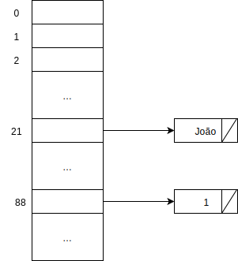

Hashing
======
Uma tabela de símbolos é uma estrutura que implementa as operações de
inserção e busca.

================ ============ =========
Implementação    Busca        Inserção
================ ============ =========
Vetor            O(n)         O(1)
Vetor ordenado   O(log(n))    O(n)
L.l.             O(n)         O(1)
L.l. ord         O(n)         O(1)
ABB              O(altura)    O(altura)
Hashing          O(1)         O(1)
================ ============ =========

Uma tabela de hashing (espalhamento) é uma tabela em que os elementos que serão armazenados serão divididos.

**Exemplo:** Uma tabela com alunos da USP.

Ideia: Podemos usar o NUSP como índice de uma tabela:

Problema: Gasta muito espaço

2ª ideia: NUSP % 100

Problema: dois ou mais alunos podem ter o mesmo final de NUSP (colisão).

Para resolver a colisão poderíamos usar:

Mas como projetar uma boa função de hash?

Ideia: métodos da divisão

h(x) = x % m
M é primo, próximo a n

É fácil para o "adversário" gerar um conjunto de dados ruim para a função.

Ideia (Knuth): multiplicação

.. math::

    h(x) = \lfloor m \cdot Frac(Ax) \rfloor

    A = \dfrac{a+\sqrt{5}}{2}

Onde Frac é a parte fracionária.

Funções de hashing que garantem um bom espalhamento (a probabilidade de colisão é pequena) são difíceis de obter. Uma forma de obter isso é o chamado hashing universal (mais disso em MAC338).

Aplicações
==========

----------
Bucketsort
----------
Suponha que queremos ordenar n números reais no intervalo :math:`[0, 1)`.

Este método pode ser usado para ordenar em tempo linear números desde que saibamos que eles estão num dado intervalo :math:`n, [a, b)`:

---------
Radixsort
---------
Cada passada tem complexidade :math:`\Theta(n)`, portanto em tempo :math:`\Theta(d \cdot n)` o vetor é ordenado onde :math:`d` é o número máximo de dígitos dos número que queremos adicionar.

