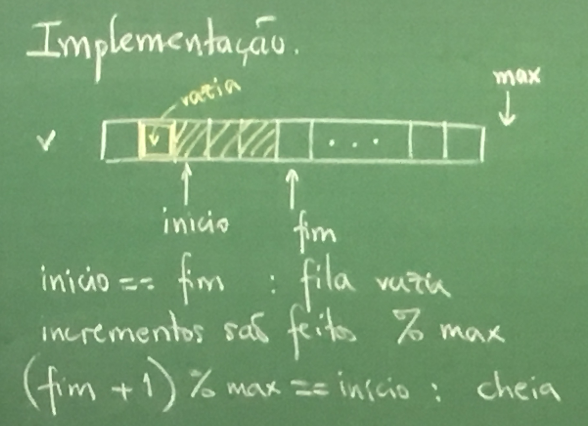

# Fila

Uma fila é uma estrura em que as inserções são feitas em uma das extremidade (fim) e as remoções são feitas na outra extremidade (começo). Com isso, o primeiro elemento a entrar vai ser o primeiro a sair da fila.

## Implementação
- **Insere**: insere um elemento no fim da fila;
- **Remove**: remove o elemento do começo da fila;
- **PrimeiroDaFila**: devolve o primeiro;
- **FilaVazia**: devolve se está vazia ou não.

```
+---+---+---+---+---+---+---+---+ max
|---|---|---|---|   |   |   |   |
+---+---+---+---+---+---+---+---+
                  ^fim     (não é bom)

+---+---+---+---+---+---+---+---+ max
|   |   |---|---|---|---|   |   |
+---+---+---+---+---+---+---+---+
         ^ início
                          ^ fim

                  v inicio
+---+---+---+---+---+---+---+---+ max
|---|   |   |---|---|---|---|---|
+---+---+---+---+---+---+---+---+
     ^ fim   ^ não é usada
                          ^ fim

inicio == fim               --> vazia
inicio == (fim + 1) % tam   --> cheia
```

 ```C
typedef TipoDaFila ...;
typedef struct {
    TipoDaFila *v;
    int max;
    int inicio;
    int fim;
} fila;

typedef fila *Fila;

Fila CriaFila(int tam) {
    Fila F = malloc(sizeof(fila));
    F->inicio = F->fim = 0;
    F->max = tam;
    F->v = malloc(tam * sizeof(TipoDaDila));
    return F;
}

void insere(Fila F, TipoDaFila x) {
    if ((F->fim + 1) %F->max == F->inicio)
        resize(F);
    F->v[F->fim] = x;
    F->fim = (F->fim + 1) % F->max;
}

int FilaVazia(Fila F) {
    return (F->inicio == F->fim);
}

void remove(Fila F) {
    if (FilaVazia(F))
        printf("Erro!");
    else
        F->inicio = (F->inicio + 1) % F->max;
}

TipoDaFila PrimeiroDaFila(Fila F) {
    if (FilaVazia(F)) {
        printf("Erro");
        return ???
    }
   
    return F->v[F->inicio]);
}
 ```



## Problema do ratinho
Agora com filas.

Ideia: a partir da posição do rato vamos numerando os vizinhos e colando numa fila. Dijkstra

```C
typedef posicao TipoDaFila;
int caminhoMinimo(int **lab, int m, int n, posicao rato, posicao queijo) {
    Fila F = CriaFila(m + n);
    posicao atual = rato;
    int dir, temsol = 1;
    lab[atual.linha][atual.col] = 1;
    insere(F, atual);

    while (!FilaVazia(F) &&
           (atual.linha != queijo.linha || atual.col != queijo.col)) {
        atual = PrimeiroDaFila(F);
        for (dir = 0; dir < 4; dir++)
            if (PodeIr(lab, m, n, atual, dir)) {
                prox = anda(atual, dir);
                insere(F, prox);
                lab[prox.linha][prox.col] = lab[atual.linha][atual.col] + 1;
            }
    }

    if (atual.linha == queijo.linha && atual.col = queijo.col)
        imprimeMatriz(lab, m, n);
    else {
        printf("Não tem caminho\n");
        temsol = 0;
    }

    destroiFila(F);
    return temsol;
}
```

---

Terça, 28 de agosto
