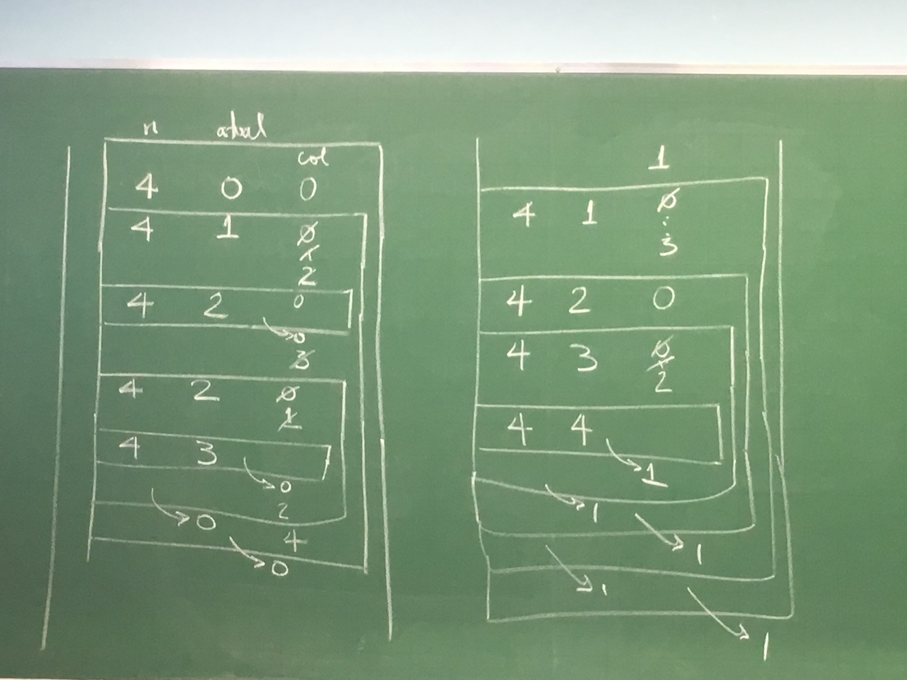

# Recursão

Dizemos que uma função é recursiva se em sua definição a própria função é usada. Isso significa que ela inclui no seu corpo uma chamada a ela mesma.

Exemplos:
$$
n! =
\begin{cases}
1, &n = 0 \\\\
n(n-1)!, &n > 0
\end{cases}
$$

$$
2^n = \begin{cases}
1, &n=0 \\\\
2 * 2^{n-1}, &n>0
\end{cases}
$$

$$
F(n) = \begin{cases}
1, &n=1 \text{ ou } n=2 \\\\
F(n-1) + F(n-2), &n>2
\end{cases}
$$


## Exemplos
Em computação dizemos que uma função é recursiva se dentro do corpo da função temos uma chamada para ela própria.

Recursão de calda: só tem uma chamada recursiva no fim.

Exemplo:

```C
int fatorial (int n) {
    if (n == 0) return 1;
    return n*fatorial(n-1));
}

int expo2(int n) {
    if (n == 0)
        return 1;
    return (2* expo2(n-1));
}
```

Ex faça uma função recursiva que recebe um vetor com n elementos inteiros e devolve o maior

```C
int maximo(int v[], int n) {
    if (n == 1) return v[0];
    int max = maximo (v, n-1);
    if (max > v[n-1])
        return (max)
    return v[n-1];
}
```

Faça uma função recursiva que recebe um inteiro d>0 e calcula a soma dos dígitos de d.

Ex: d=2751438 -> 30


Exemplos: idem a aula anterior


**Exercício:** Dado n > 0, devolver a soma dos dígitos de n.

Ex: 21340071 -> 18

```C
int somaDigitos(int n) {
    /* n > 0 */
    if (n < 10) return n;
    return ((n % 10) + somaDigito(n/10));
}
```

**Exercício:** Faça uma função que recebe um vetor com n>0 números inteiros e devolve a média desses números.

```C
float media(int v[], int n) {
    if (n == 1)
        return v[0];

    return (media(v, n-1)*(n-1) + v[n-1])/n;
}
// chamada: media(vetor, 0, n)
```

Simulação:

```
n = 4: 12, 7, -3, 5

+----------------------+
|    4                 |
+--------------------+ |
|    3               | |
+------------------+ | |
|    2             | | |
+---------------+  | | |
|    1          |  | | |
+---------------+  | | |
|     -> 12*1|7    | | |
+------------------+ | |
|  ->  9,5*2|(|3)    | |
+--------------------+ |
| -> 16/3*3|5/4        |
+----------------------+
 -> 5.25

```


## Torres de Hanoi

Na torre A são dados n discos de diâmetros diferentes que devem ser movidos para a torre C podendo usar B como auxiliar.

As regras para movimentar os discos são:

1. São pode mover 1 disco por vez.
2. Não pode colocar um disco maior sobre um menor.

n=3 → 7 movimentos

```
 1
 2
 3
+---------+
 A  B  C

 2                 1
 3       1         2  3
+---------+   +--------+

 3   2   1     1   2  3
+---------+   +--------+         1
     1                2          2
 3   1         1      3          3
+---------+   +--------+   +------+
```

```
    XX
   X  X
  X  n X
 X      X
+-------------------+
    A     B      C

         XX
        X  X
       X n-1X
   n  X      X
+-------------------+

         XX
        X  X
       X n-1X
      X      X   n
+-------------------+


               XX
              X  X
             X n-1X
            XXXXXXXX
           X    n   X
+-------------------+
```

```C
void hanoi(int n, char origem, char aux, char destino) {
    /* n>= 0 */
    if (n > 0) {
        hanoi(n-1, origem, destino, aux);
        printf("Mova o disco %d de %c para %c\n", n, origem, destino);
        hanoi(n-1, aux, origem, destino);
    }
}
```

Simulação:

```
+------------------------+
| 3 A B C                |
+--------------------v-+ |
| 2 A C B              | |
+------------------v-+ | |
| 1 A B C            | | |
+---------------v-+  | | |
| 0 A C B         |  | | |
+-----------------+  | | |
+---------------l-+  | | |
| 0 B A C         |  | | |
+-----------------+  | | |
|--------------------+ | |
+------------------l-+ | |
| 1 C A B            | | |
+--------------v-+   | | |
| 0              |   | | |
+----------------+   | | |
+--------------l-+   | | |
| 0              |   | | |
+----------------+   | | |
|--------------------+ | |
+----------------------+ |
|                        |
+----------------------+ |
| 2 B A C              | |
+------------------v-+ | |
| 1 B C A            | | |
+----------------v-+ | | |
| 0                | | | |
+------------------+ | | |
+----------------l-+ | | |
| 0                | | | |
+------------------+ | | |
+--------------------+ | |
|                      | |
+------------------l-+ | |
| 1 A B C            | | |
+--------v-+         | | |
| 0        |         | | |
+--------l-+         | | |
| 0        |         | | |
+----------+         | | |
|--------------------+ | |
+----------------------+ |
|                        |
+------------------------+
```

Podemos mover os n discos com $2^n-1$ movimentos.

**Prova:**

$$
\begin{aligned}
n = 0 \\\\
2^n - 1 + 1 + 2^{n-1}-1 \\\\
2 \cdot 2^n - 1
\end{aligned}
$$

## Curvas de Hilbert

```
                         <---+
      <-+
                      +---<----+    +   +
   +------+           | A      |  D |   |
+  |                  |        +----+   v
|  |                  +-----+
v  |                        |
   +------>           +---<-+  +----+   +
                      | A      |  B |   |
     +-->             |        |    |   v
     H1               +--------+    v

                         +--->
                         H2
```

Para desenhar uma curva de Hilber de profundidade  fazemos 4 cópias de figuras de profundidade n-1:

Se denotarmos por:

```
+-----+   +-----+   <----+   ^     +
|         |     |        |   |     |
|  A      |  B  |     C  |   |  D  |
|         |     |        |   |     |
+----->   +     v   +----+   +-----+
```


- **A**: D ← A ↓ A → B
- **B**: C ↑ B → B ↓ A
- **C**: B → C ↑ C ← D
- **D**: A ↓ D ← D ↑ C

Curvas deste tipo são chamadas de fractais, e tem a propriedade de que:

> O todo tem a mesma estrutura que cada pequena parte.

Estes padrões ficaram na moda na década de 80 depois do livro _The fractal geometry of nature._ (B. B. Maldelbrot).

## N Rainhas

Retomando o problema das n Rainhas:

Dado n>0, é posível colocar n rainhas num tabileiro de xadrez sem que elas se ataquem?

- n=4

```
+-----+-+
| |R| | |
+-------+
| | | |R|
+-------+
|R| | | |
+-------+
| | |R| |
+-+-----+
```

- n=3

```
+-+-+-+
| | | |
+-----+
| | | |
+-----+
| | | |
+-+-+-+
```

```C
int nRainhasrec(int **tab, int n, int atual) {
    /* devolve 1 se é possível, 0 caso contrário */
    if (atual == n) return 1;
    for (col = 0; col < n; col++)
        if (PosicaoLivre(tab, n, atual, col) == 1) {
            tab[atual][col] = 1;
            if (nRainhasrec(tab, n, atual+1))
                return 1;
            tab[atual][col] = 0;
        }
    return 0;
}

int main() {
    int **tab, n;
    scanf("%d", &n);
    tab = alocaMatriz(n, n);
    if (nRainhasrec(tab, n, 0) == 1)
        imprimeMatriz(tab, n, n);
    else
        printf("Não tem solução\n");
}
```

Simulação

- n=3

```
   n    atual   col         =] representa o retorno da função
+----------------------+
|  3      0      0     |
+--------------------+ |
|  3      1      0   | |
|                1   | |
|                2   | |
+------------------+ | |
|  3      2   0,1,2| | |
|                3 | | |
+------------------+ | |
|       =]0      3   | |
+--------------------+ |
|       =]0      1     |
+--------------------+ |
|  3      1      0   | |
+--------------------+ |
|       =]0      2     |
+--------------------+ |
|  3      1      0   | |
+------------------+ | |
|  3      2      0 | | |
+------------------+ | |
|         =]0  1,2,3 | |
+--------------------+ |
|                3     |
+----------------------+
                =]0
```

- n=4



## Busca recursiva

Faça uma função recursiva que recebe um vetor `v`, com `n >= 0` inteiros e um inteiro `x` e devolve um índice `i` do vetor com `v[i] = x` ou `-1` se `x` não está no vetor.

```C
int buscarec(int v[], int n, int x) {
    if (n == 0)
        return -1;
    
    if (v[n-1] == x)
        return n - 1;

    return busca(v, n-1, x);
    // Pior caso:   O(n)  x não está
    // Melhor caso: O(1)  x == v[n-1]
}

int busca(int v[], int n, int x) { // versão iterativa
    int i = n - 1;
    while (i >= 0 && v[i] != x)
        i--;
    return i;
    // Pior caso:   O(n)  x não está
    // Melhor caso: O(1)  x == v[n-1]
}
```


E na média? (qual a complexidade assintótica no "caso médio"?)

Supondo que x está no vetor e pode estar em qualquer posição com igual probabilidade.
$$
\begin{aligned}
\mathbb{E}(\text{nº de iterações}) &= 1 * \dfrac{1}{n} + 2 * \dfrac{1}{n} + \ldots + n * \dfrac{1}{n} \\\\
 &= \dfrac{1}{n}(1+2+\ldots+n) \\\\
 &= \dfrac{1}{n}\left(\dfrac{(n+1)n}{2}\right) \\\\
 &= \dfrac{n+1}{2}
\end{aligned}
$$

## Busca binária

```C
int buscabinR(int v[], int inicio, int fim, int x) {
    int meio;
    if (fim < inicio)
        return -1;
    meio = (inicio + fim)/2;
    if (v[meio] == x)
        return inicio;
    if (v[meio] == x) return meio;
    if (v[meio] > x) return buscabinR(v, inicio, meio-1, x);
    return buscabinR(v, meio+1, fim, x);
}
```

```C
int buscabin(int v[], int n, int x) {
    int inicio, fim, meio;
    inicio = 0; fim = n-1;
    while (inicio <= fim) {
        meio = (inicio + fim)/2;
        if (v[meio] == x) return meio;
        if (v[meio] > x) fim = meio - 1;
        else inicio = meio + 1;
    }
    return -1;
}
```

Supondo que está no vetor e `v[i] ==x` com igual probabilidade para `i=0 ... n-1`:
$$
\begin{aligned}
\mathbb{E}(\text{nº de iterações}) &= 1 * \dfrac{1}{n} + 2 * \dfrac{1}{n} + 3 * \dfrac{1}{n} + \ldots + log_2{n} * \dfrac{1}{n} \\\\
 &= \dfrac{1}{n}(1+2+3+\ldots+log_2{n}) \\\\
 &= \dfrac{log_2{n}(log_2{n}+1)}{2n}
\end{aligned}
$$

------

Terça, 11 de setembro