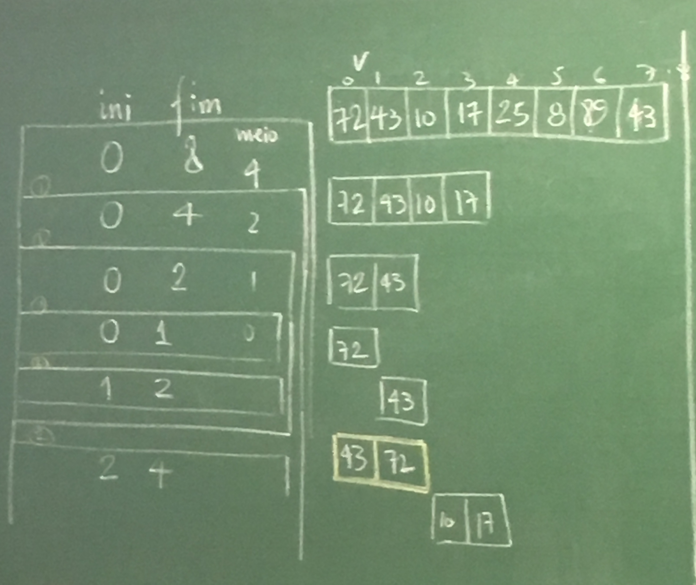
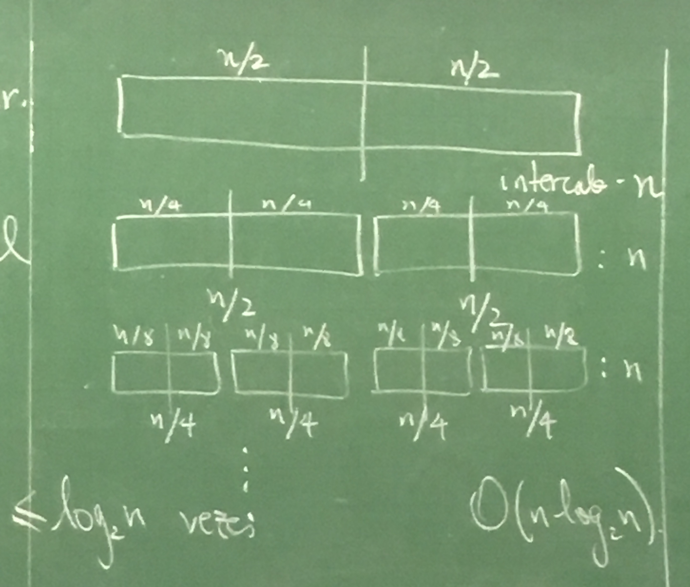

#########
Ordenação
#########

**Problema geral:** Dado um vetor com `n >= 0` elementos, rearranje os elementos do vetor de forma que fiquem em ordem crescente: `v[0] <= v[1] <= ... <= v[n-1]`

Ordenação por seleção
=====================
**Ideia:** Em cada passo encontra o maior do pedaço do vetor que estamos considerando e troca com o último. Em `n-1` passos o vetor está ordenado.

::

    44  75  12 27 *95* 15   3   73  19     maior: 95
    44 *75* 12 27  19  15   3   73 [95]    maior: 75
    44 *73* 12 27  19  15   3  [75  95]    maior: 73
    ...
    Com n-1 passos, o vetor está ordenado
    ( )[                              ]

.. code-block:: c

    void troca(float v[], int i, int j) {
        float aux = v[i];
        v[i] = v[j];
        v[j] = aux;
    }

    void selecao(float v[], int n) {
        int i, imax, j;
        for (i = 1; i <= n-1; i++) {
            /* Invariante: Para todo i, sei que os i-1 maiores
             * números estão ordenados à direita.
             */
            imax = 0;
            for (j = 1; j <= n-i; j++) {
                /* Invariante: Para todo j, sei que imax contém o
                 * índice do maior número até o j-ésimo elemento.
                 */
                if (v[j] > v[imax])
                    imax = j;
            }
            troca(v, n-i, imax);
        }
    }

Anexo: `insertionsort.c`_

Para analisar um loop em um algoritmo ou verificar sua **corretude**, utiliza-se técnicas como **invariantes** de loop: aquilo que está correto em todas as iterações.

Complexidade
------------

Número de comparações:

.. math::

    n-1 + n-2 + ... + 1 = \dfrac{n(n-1)}{2}

**Pior caso:**

Comparações: :math:`O(n^2)`
Trocas: :math:`O(n)`.

**Ideia:** e se em cada iteração achássemos o máximo e o mínimo e trocássemos os dois?

.. code-block:: c

     i-1            i-1
    +------------------+
    | <= |        | <= |
    +------------------+

Temos :math:`n/2` iterações.

Trocas: <=2 por iteração: :math:`O(n)`.

Recursivo
---------

.. code-block:: c

    void selecaoRec(flat v[], int n) {
        int i, imax;
        if (n > 1) {
            imax = 0;
            for (i = 1; i < n; i++)
                if (v[i] > v[imax])
                    imax = 1;
            troca(v, imax, n-1);
        }
        selecaoRec(v, n-1);
    }

Bubble sort
===========
**Ideia:** em cada iteração percorra o vetor comparando elementos vizinhos e trocando-os se estão na ordem errada. Quando não tiver mais elementos invertidos, o vetor estará ordenado. Sabemos que em cada iteração, um elemento vai pro lugar.

::

      44      44                 44  12                  12
    - 75  12  12                 12  44  27              27
    - 12  75  27                 27      44              44
    - 27      75                 75          15          15
      95      95  15             15          75   3      3
      15      15  95  3           3              75  73  73
       3       3     93  73  73  73                  75  19
      73      73         95  19  19                      75
      19      19                 95                      95

.. code-block:: c

    void bubble(float v[], int n) {
        int i, j;
        for (i = 1; i < n; i++)
            for (j = 0; j < n-i; j++)
                if (v[j+1] < v[j]) {
                    troca(v, j, j+1);
                    trocou = 1;
                }
    }

Complexidade
------------

==========================  =========================================  =============
Caso                        Comparações                                Trocas
==========================  =========================================  =============
Melhor (vetor ordenado)     :math:`O(n)`                               :math:`0`
Pior (ordem inversa)        :math:`\dfrac{n(n-1)}{2} \implies O(n^2)`  :math:`O(n^2)`
==========================  =========================================  =============

Recursivo
---------

.. code-block:: c

    void bubbleRec(float v[], int n) {
        int i, troca = 0;
        if (n > 1) {
            for (i = 0; i < n-1; i++) {
                if (v[i+1] < v[i]) {
                    troca(v, i, i+1);
                    trocou = 1;
                }
            }
            if (trocou)
                bubbleRec(v, n-1);
        }
    }

Insertion sort
==============
John Mauchly, 1946

**Ideia:** Em cada iteração o vetor está divido em duas partes: uma parte ordenada no início do vetor e uma parte bagunçada no resto. Pegamos o primeiro elemento da parte bagunçada e o inserimos na posição correta da parte ordenada.

::

    ordenado            bagunça
    [44]  75  12  27  95  15   3   73  19
    [44   75] 12  27  95  15   3   73  19
    [12   44  75] 27  95  15   3   73  19

.. code-block:: c

    void insercao(float v[], int n) {
        int b, i;
        float x;
        for (b = 1; b < n; b++) {
            x = v[b];
            for (i = b - 1; i >= 0 && v[i] > x; i--)
                v[i + 1] = v[i];
            v[i + 1] = x;
        }
    }

    void insercaoRec(float v[], int n) {
        int i; float x;

        if (n > 1) {
            insercaoRec(v, n-1);
            x = v[n-1];
            for (i = n-2; i>= 0 && v[i] > x; i--)
                v[i+1] = v[i];
            v[i+1] = x;
        }
    }

Complexidade
------------

* Melhor caso (lista ordenada):
    * Comparações: :math:`n-1 \implies O(n)`
    * Movimentos: :math:`2(n-1)`

* Pior caso (ordem inversa):
    * Comparações: :math:`1 + 2 + \ldots + n-1 = \dfrac{n(n-1)}{2} \implies O(n^2)`
    * Movimentos: :math:`2(n-1)+\dfrac{n(n-1)}{2}`

Uma análise de caso médio pode ser feita, assumindo por exemplo que para todo :math:`b=1, ..., n-1` a probabilidade de :math:`x` ser inserido em qualquer posição é :math:`1/b`.

.. math::

    \begin{align}
    \mathbb{E}(\text{no. de comparações}) &= 1 \cdot 1 + (1 + 2) 1/2 + (1 + 2 + 3) 1/3 + \ldots \\
    &= \sum^n_{i+1}\left(1 + 2 + \ldots + i\right) \cdot 1/i \\
    &= \sum^n_{i+1}\left(\dfrac{i(i+1)}{2}\right)\cdot \dfrac{1}{i} \\
    \implies O(n^2)
    \end{align}

Inserção binária
----------------

John Mauchly, 1946

Podemos melhorar o algoritmo com relação ao número de comparações.
::

     ordenado
    [        ][              ]
     ^ busca binária

* Número de comparações:

.. math::

    \sum^{n}_{b=1}{log_2{b}} &\leq \int^n_1{\log_2{x} dx} \\
    \int^n_1{log_2{x} dx} &= \dfrac{1}{\ln{2}} \int^n_1{ln{x} dx} \\
    &= \dfrac{1}{\ln{2}}[x \ln{x}+x]^n_1 \\
    &= \dfrac{1}{\ln{2}}(n \ln{n} + n - 1) &= n \log_2{n} + n -1 \\
    \implies O(n \log_2{n})&

Mergesort
=========

von Neumann, 1945

::

    [          |           ]

    [ ordenado ][ ordenado ]

            intercala
    [                      ]

::

    117   195   81   43 | 15   79   18   80   47
     v     v
    15    18    43   47 | 15   18   47   79   80

    15    18    43   47 | 79   80   81   117  195

**Ideia:**  Divisão e conquista. O vetor é divido na metade e cada metade é ordenada. Então, os elementos são intercalados para obter o vetor ordenado.

.. code-block:: c

    void intercala(float v[], int p, int q, int r) {
        float *aux = maloc((r-p) * sizeof(float));
        int i = p, j = q, k =0;
        while (i < q && j < r)
            if (v[i] < v[j]) {
                aux[k] = v[i];
                k++; i++;
            }
            else {
                aux[k] = v[j];
                k++; j++;
            }

        while (i < q) {
            aux = v[i];
            k++; i++
        }

        while (j < r) {
            aux[k] = v[j];
            k++; j++;
        }

        for (i = p, k = 0; i < r; i++, k++)
            v[i] = aux[k];

        free(aux);
    }

    void mergesort(float v[], int ini, int fim) {
        int meio = (ini + fim)/2;
        if (fim > ini) {
            mergesort(v, ini, meio);
            mergesort(v, meio, fim);
            intercala(ini, meio, fim);
        }
    }

Simulação:

Complexidade
------------

* Função intercala:
    * Número de comparações :math:`n-1 \implies O(n)`, onde :math:`n=r-p`.

O intercala tem complexidade linear. Assim, em cada nível, o :code:`mergesort` divide o valor e ao chamar o intercala, o número total de comparações por nível é :math:`O(n)`.

A desvantagem do algoritmo é usar espaço extra para ordenar o vetor. É possível implementar o intercala sem usar espaço extra, perdendo na complexidade. É possível também implementar o :code:`mergesort` em espaço adicional com a mesma complexidade.

Quicksort
=========
Hoare, 1960

A ideia do algoritmo é aplicar divisão e conquista de uma forma diferente. Escolhemos um pivô e dividimos os elementos do vetor de forma que os menores ou iguais ao pivô são movidos para o início e os maiores para o fim.

::

    [40] 12  25  45  72  10  39  14  23  42  37  61
     12  25  10  39  14  23  37 [40] 45  72  42  61
     |------------v------------|    |------v------|
     10 [12] 25  39  14  23  37      42 [45] 72  61
             14  23 [25] 39  37              61 [72]
            [14] 23      37 [39]

Com isso, o pivô vai para a posição correta no vetor ordenado.

::
          pivô
    [  <=  []   >    ]

Basta, então, ordenar recursivamente os dois pedaços do vetor.

Se eu der sorte na escolha do pivô, cada execução do separa divide o vetor em dois pedaços de tamanho iguais.
::

    [      []      ] n
    [ []  ]  [ []  ] n/2
    [ ] [ ]  [ ] [ ] n/4   logn

Se eu der azar,
::

    n   [               []]
    n-1 [[]               ]    |
    n-2    [[]            ]    |  n-1
             [          []]    v

.. code-block:: c

    int separa(float v[], int ini, int fim) {
        int p = ini, q = fim - 1;
        float pivo = v[ini];
        while (p < q) {
            while (v[q] > pivo)
                q--;
            if (q > p)
                troca(v, p, q);
            while (p < q && v[p] <= pivo)
                p++;
            if (p < q)
                troca(v, p, q);
        }
    }

    void Quicksort(float v[], int ini, int fim) {
        int pivo;
        if (fim - ini >= 2) {
            pivo = separa(v, ini, fim);
            Quicksort(v, ini, pivo);
            Quicksort(v, pivo+1, fim);
        }
    }

Anexo: `quicksort.c`_

Complexidade
------------

Com isso, no melhor caso::

      n/2     n/2
    [      []      ]     n    | log_2 n
    [      ][      ]   < n    v
    O(n log_2 n)

E no pior caso::

    [           []]  n
    [             ]  n-1       O(n^2)

Variação do Sedgewick
---------------------

.. code-block:: c

    int separa(float v[], int ini, int fim) {
        /* R. Sedgewick */
        int i = ini - 1, j;
        float pivo = v[fim - 1];
        for (j = ini; j < fim; j++)
            if (v[j] <= pivo) {
                i++;
                troca(v, i, j);
            }
        return i;
    }

Análise do caso médio
^^^^^^^^^^^^^^^^^^^^^
Seja :math:`C(n)` o número total de comparações (*) executadas para ordenar um vetor com n elementos na média, considerando que a probabilidade do separa devolve qualquer índice é a mesma.

.. math::

    C(n) = \begin{cases}
        0 &\text{, se } n =1 \text{ ou } n = 1 \\
        n + prob(\text{separa devolver o 1º})\cdot(C(0) + C(n-1)) +
        &\text{, se } n \geq 2 \\
        prob(\text{separa devolver o 2º})\cdot(C(1) + C(n-2)) + \\
        prob(\text{separa devolver o 3º})\cdot(C(2) + C(n-3)) + \\
        \ldots \\
        prob(\text{separa devolver último})\cdot(C(n-1) + C(0)) \\
    \end{cases}

    C(n) = \dfrac{1}{n}\Left[C(0) + C(n-1) + C(1) + C(n-2) + \ldots + C(n-1) + C(0)\Right]
    C(n) = n + \dfrac{2}{n}
    \sum^{n-1}_{i=0} c(i)

Aleatorizado
------------

Em cada chamada do algoritmo, um elemento do vetor é escolhido para pivô e o vetor é reorganizado:

::

    [ <= x  (x)   > x     ]
             ^ pivô

Como fazer esta separação:
1. Hoare "closing gap"

::

    v pivô
    x   [  <=x  |        |  >x ]

2. Sedgewick

::

    v pivo      i          j
    x   [ <=x    |  >x    |    ]

.. code-block:: c

    int separaAleatorio(float v[], int ini, int fim) {
        int r = random(ini, fim);  // sorteia índice [ini, fim-1]
        troca(v, r, fim - 1);
        return separaSedgewick(v, ini, fim);
    }

    void quickSortAleatorizado(float v[], int ini, int fim) {
        int pivo;
        if (fim - ini > 1) {
            pivo = separaAleatorizado(v, ini, fim);
            quickSortAleatorizado(v, ini, pivo);
            quickSortAleatorizado(v, pivo + 1, fim);
        }
    }

A versão aleatorizada do quicksort tem complexidade esperada :math:`O(n\log{n})`. Note que a probabilidade de ocorrer o pior caso é praticamente nula :math:`\dfrac{2^n}{n!}`.

Complexidade
^^^^^^^^^^^^

* Melhor caso: :math:`O(n\log{n})`
* Pior caso: :math:`O(n^2)`
* Caso médio: :math:`O(n\log{n})`

Heapsort
========
Williams, Floyd 1960

Uma heap é estrutura hierárquica (árvore) com as seguintes propriedades:

1. É completa até o penúltimo nível;
2. Os elementos do último nível estão o mais à esquerda possível;
3. Cada elemento é maior que seus filhos.

Exemplo::

             ___1__
            /      \
        ___21       17
       /     \     /  \
      20      1   8    14
     /  \
    7    4

Um jeito simples de representar um heap é usando um vetor::

     0  1  2  3  4  5  6  7  8
    [43|21|17|20| 1| 8|14| 7| 4]

Os filhos do elemento na posição :math:`i` em :math:`2i+1` e :math:`2i+2`.
O pai do elemento na posição :math:`i` está com :math:`(i-1)/2`.

Suponha que temos uma função que recebe um vetor e o transforma num heap.

::

    void heapifica(v, n) {
        heapifica(v, n);
        for (i = n-1; i > 0; i--) {
            troca(v, 0, i);
            heapifica(v, i);
            rebaixa(v, i, 0);
        }
    }

    void heapifica(float v[], int n) {
        int i;
        for(i = (n-2)/2; i >= 0; i--) {
            rebaixa(v, n, i);
        }
        // Numa primeira análise executamos n/2 * rebaixa, portanto,
        // O(nlogn).
        // Uma análise mais cuidadosa mostra O(n).
    }

    void rebaixa(float v[], int n, int i) {
        int pai, filho;
        pai = i; filho = 2*i + 1;

        while (filho < n) {
            if (filho + 1 < n && v[filho + 1] > v[filho])
                filho++;

            if (v[filho] < v[pai])
                break;
            else {
                troca(v, pai, filho)
                pai = filho;
                filho = 2*pai + 1;
            }
        }
    }

::

    30  27  10  17  19  48  39  4   25
    48  39  30  25  10  27  19  17  4
    4   39  30  25  10  27  19  17  48

            ____4___
           /        \
         _39        _30
        /   \      /   \
      _25    10   27    19
     /
    17

Comparação
==========

=================   ======================================
Algoritmo           Complexidade (pior caso)
=================   ======================================
Seleção             :math:`O(n^2)` comparações, O(n) trocas
Bubblesort          :math:`O(n^2)` comparações e trocas
Insercao            :math:`O(n^2)` comparações e movimentos
Inserção binária    :math:`O(n \log_2{n})` comparações :math`O(n^2)` movimentos
Mergesort           :math:`O(n \log_2{n})`
Quicksort           :math:`O(n \log_2{n})`
=================   ======================================

Links
=====
* `Sorting algorithms`_
* `Gifs de ordenação`_

.. _Sorting algorithms: https://www.programming-algorithms.net/article/39344/Bubble-sort
.. _Gifs de ordenação: ../ordenacao-gifs.html
.. _quicksort.c: ../_static/quicksort.c
.. _insertionsort.c: ../_static/insertionsort.c

Terça-feira, 18 de setembro
Quarta-feira, 20 de setembro
