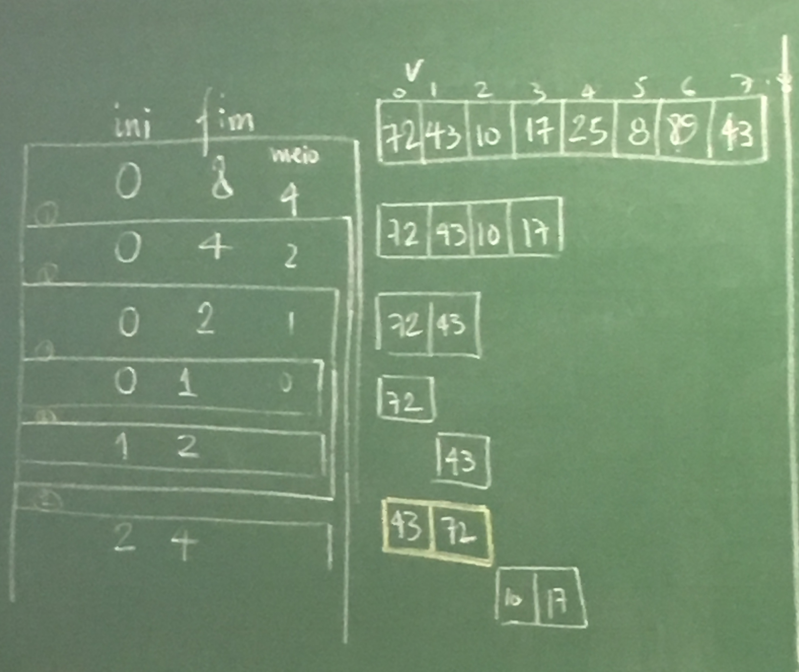

#########
Ordenação
#########

Insertion Sort
==============

**Ideia:** Em cada iteração o vetor está divido em duas partes: uma parte ordenada no início do vetor e uma parte bagunçada no resto. Pegamos o primeiro elemento da parte bagunçada e o inserimos na posição correta da parte ordenada.

::

    ordenado            bagunça
    [44]  75  12  27  95  15   3   73  19
    [44   75] 12  27  95  15   3   73  19
    [12   44  75] 27  95  15   3   73  19

.. code-block:: c
    :linenos:

    void insercao(float v[], int n) {
        int b, i;
        float x;
        for (b = 1; b < n; b++) {
            x = v[b];
            for (i = b - 1; i >= 0 && v[i] > x; i--)
                v[i + 1] = v[i];
            v[i + 1] = x;
        }
    }

    void insercaoRec(float v[], int n) {
        int i; float x;

        if (n > 1) {
            insercaoRec(v, n-1);
            x = v[n-1];
            for (i = n-2; i>= 0 && v[i] > x; i--)
                v[i+1] = v[i];
            v[i+1] = x;
        }
    }

Complexidade
------------

* Melhor caso (lista ordenada):
    * Teste :math:`n-1 \text{comparações} \implies O(n)`
    * :math:`2(n-1) \text{movimentos}`

* Pior caso (ordem inversa):
  * :math:`1 + 2 + \ldots + n-1 = \dfrac{n(n-1)}{2} \text{comparações} \implies O(n^2)`
  * :math:`2(n-1)+\dfrac{n(n-1)}{2} \text{movimentos}`

Uma análise de caso médio pode ser feita, assumindo por exemplo que para todo :math:`b=1, ..., n-1` a probabilidade de :math:`x` ser inserido em qualquer posição é :math:`1/b`.

.. math::

    \mathbb{E}(\text{no. de comparações}) = 1 \cdot 1 + (1 + 2) 1/2 + (1 + 2 + 3) 1/3 + (1 + 2 +3 + 4) 1/4 + \ldots \\
    = \sum^n_{i+1}(1 + 2 + \ldots + i) \cdot 1/i \\
    = \sum^n_{i+1}(\dfrac{i(i+1)}{2})\cdot \dfrac{1}{i} \\
    \implies O(n^2)

Inserção binária
----------------

John Mauchly, 1946

Podemos melhorar o algoritmo com relação ao número de comparações.
::

     ordenado
    [        ][              ]
     ^ busca binária

* Número de comparações:

.. math::

    \begin{aligned}
    \sum^{n}_{b=1}{log_2{b}} &\leq \int^n_1{\log_2{x} dx} \\
    \int^n_1{log_2{x} dx} &= \dfrac{1}{\ln{2}} \int^n_1{ln{x} dx} = \dfrac{1}{\ln{2}}[x \ln{x}+x]^n_1 \\
    = \dfrac{1}{\ln{2}}(n \ln{n} + n - 1) &= n \log_2{n} + n -1 \\
    \implies O(n \log_2{n})&
    \end{aligned}

Mergesort
=========

von Neumann, 1945

::

    [          |           ]

    [ ordenado ][ ordenado ]

            intercala
    [                      ]

::

    117   195   81   43 | 15   79   18   80   47
     v     v
    15    18    43   47 | 15   18   47   79   80

    15    18    43   47 | 79   80   81   117  195

**Ideia:**  Divisão e conquista. O vetor é divido na metade e cada metade é ordenada. Então, os elementos são intercalados para obter o vetor ordenado.

.. code-block:: c

    void intercala(float v[], int p, int q, int r) {
        float *aux = maloc((r-p) * sizeof(float));
        int i = p, j = q, k =0;
        while (i < q && j < r)
            if (v[i] < v[j]) {
                aux[k] = v[i];
                k++; i++;
            }
            else {
                aux[k] = v[j];
                k++; j++;
            }

        while (i < q) {
            aux = v[i];
            k++; i++
        }

        while (j < r) {
            aux[k] = v[j];
            k++; j++;
        }

        for (i = p, k = 0; i < r; i++, k++)
            v[i] = aux[k];

        free(aux);
    }

    void mergesort(float v[], int ini, int fim) {
        int meio = (ini + fim)/2;
        if (fim > ini) {
            mergesort(v, ini, meio);
            mergesort(v, meio, fim);
            intercala(ini, meio, fim);
        }
    }

Simulação:

Complexidade
------------

.. image:: resources/mergesort-complexidade.jpg

* Função intercala:
    * Número de comparações :math:`n-1 \implies O(n)`, onde :math:`n=r-p`.

O intercala tem complexidade linear. Assim, em cada nível, o :code:`mergesort` divide o valor e ao chamar o intercala, o número total de comparações por nível é :math:`O(n)`.

A desvantagem do algoritmo é usar espaço extra para ordenar o vetor. É possível implementar o intercala sem usar espaço extra, perdendo na complexidade. É possível também implementar o :code:`mergesort` em espaço adicional com a mesma complexidade.

Quicksort
=========
Hoare, 1960

**Ideia:** divisão e conquista.
